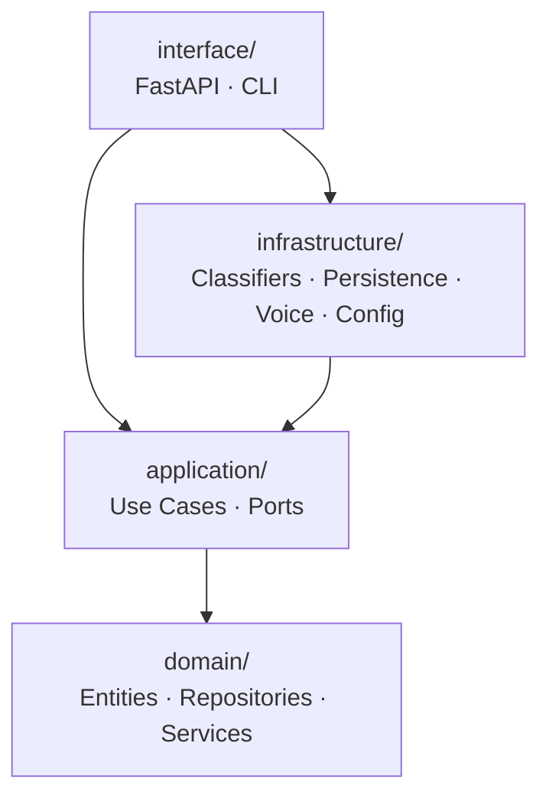

# ripoti-kwa-siri

`ripoti-kwa-siri` is a voice-first anonymous reporting platform for corruption and organized crime tips. A citizen calls a dedicated number, safely shares what they know, receives a tracking code, and the report is routed to the right investigative body — without a face-to-face visit, without attaching their identity to the record.

## Service Flow

1. **The Call** — a citizen calls the hotline to report corruption, abuse of office, trafficking, extortion, or organized crime.
2. **The Shield** — the intake flow explains that the report will be stored without attaching the caller's phone number to the case record.
3. **The Interview** — the agent listens, captures the story, and asks clarifying questions that improve investigative value.
4. **The Receipt** — the caller receives a unique tracking code such as `Kiongozi-3f9a12`.
5. **The Hand-off** — the report is summarized, classified, and routed to the appropriate investigative body.

## Architecture

`ripoti-kwa-siri` is structured as clean architecture with four strict layers. Dependencies only point inward — the domain knows nothing about FastAPI, databases, or LLM providers.



### Domain layer

The innermost layer. No external dependencies.

- `entities/` — `CaseReport`, `RoutingClassification`, `TrackingReference`
- `repositories/` — `ICaseRepository` protocol (interface only — infrastructure implements it)
- `services/` — privacy scrubbing, case summary, tracking code generation, routing destination

### Application layer

Orchestrates domain objects. Depends only on the domain.

- `use_cases/` — `SubmitReportUseCase` (intake → finalise → persist → respond)
- `ports/` — `RoutingClassifier`, `LiveRoutingClassifier` protocols

### Infrastructure layer

Implements the application ports. Knows about external providers.

- `config/` — `AppSettings` (pydantic-settings, environment-driven)
- `persistence/` — `InMemoryCaseRepository` (implements `ICaseRepository`)
- `classifiers/` — `GeminiRoutingClassifier`, `OpenAIRoutingClassifier`, `RuleBasedRoutingClassifier`, `FallbackRoutingClassifier`
- `voice/` — `SautiAgent`, LiveKit telephony bridge, voice model settings

### Interface layer

The outermost layer. Bridges HTTP and CLI to the application layer.

- `api/` — FastAPI app, intake route, request/response schemas
- `cli/` — `run_agent.py`, `run_api.py` entry points

## Repository Structure

```text
ripoti-kwa-siri/
├── src/
│   ├── domain/
│   │   ├── entities/
│   │   │   ├── case.py               # CaseReport entity
│   │   │   ├── routing.py            # RoutingClassification, ReportType
│   │   │   └── tracking.py           # TrackingReference
│   │   ├── repositories/
│   │   │   └── case_repository.py    # ICaseRepository protocol
│   │   └── services/
│   │       ├── privacy.py            # Scrub and strip caller identifiers
│   │       ├── summary.py            # Build case summary
│   │       ├── tracking.py           # Generate tracking code
│   │       └── routing.py            # Map report type to destination
│   │
│   ├── application/
│   │   ├── ports/
│   │   │   └── classifier.py         # RoutingClassifier protocol
│   │   └── use_cases/
│   │       └── submit_report.py      # SubmitReportUseCase
│   │
│   ├── infrastructure/
│   │   ├── config/
│   │   │   └── settings.py           # AppSettings
│   │   ├── persistence/
│   │   │   └── memory_case_repository.py
│   │   ├── classifiers/
│   │   │   ├── gemini.py
│   │   │   ├── openai.py
│   │   │   ├── rule_based.py
│   │   │   └── fallback.py           # Gemini → OpenAI → RuleBased chain
│   │   └── voice/
│   │       ├── agent.py              # SautiAgent + LiveKit server
│   │       ├── telephony.py          # SIP trunk and dispatch rule builders
│   │       └── model_settings.py     # Voice model config
│   │
│   └── interface/
│       ├── api/
│       │   ├── main.py               # FastAPI app factory
│       │   ├── routes/intake.py      # POST /intake/preview
│       │   └── schemas/intake.py     # IntakeRequest, IntakeResponse
│       └── cli/
│           ├── run_agent.py
│           └── run_api.py
│
├── run_agent.py                       # Root entry point — voice agent
├── run_api.py                         # Root entry point — REST preview
├── prompts/
│   └── anonymous_reporting_agent.yaml # Sauti agent instructions
├── tests/
│   ├── test_intake.py
│   ├── test_privacy.py
│   ├── test_routing.py
│   └── test_telephony.py
├── infra/
│   └── scripts/
└── docs/
    ├── architecture/
    └── product/
```

## Design Principles

- **Anonymous by default** — the case record never carries a direct caller identity
- **Minimize data** — ask only for details that help routing or investigation
- **Track without identity** — the caller uses a human-readable tracking code, not a personal reference
- **Route intelligently** — each case goes to the institution best suited to act on it (EACC, DCI, or review queue)
- **Dependency rule** — inner layers never import from outer layers; the domain is free of all framework concerns

## Routing

The classifier chain runs in order until one succeeds:

1. `GeminiRoutingClassifier` — Google Gemini structured output
2. `OpenAIRoutingClassifier` — OpenAI JSON schema fallback
3. `RuleBasedRoutingClassifier` — keyword matching, always available

| Report type | Destination |
|---|---|
| `corruption` | EACC |
| `organized_crime` | DCI |
| `unknown` | review_queue |

## Setup

Install [uv](https://docs.astral.sh/uv/getting-started/installation/), then:

```bash
uv sync --extra dev
cp .env.example .env.local   # set GOOGLE_API_KEY, OPENAI_API_KEY, realtime URL/key/secret
```

Run the voice agent:

```bash
uv run run_agent.py
```

Run the REST preview:

```bash
uv run run_api.py
```

Run tests:

```bash
uv run python -m pytest tests/ -v
```

## Important Note

Claims such as `encrypted`, `anonymous`, or `scrubbed` should only be shown to users when the actual telephony, storage, and hand-off implementation truly supports them. This repository is currently at prototype stage.
