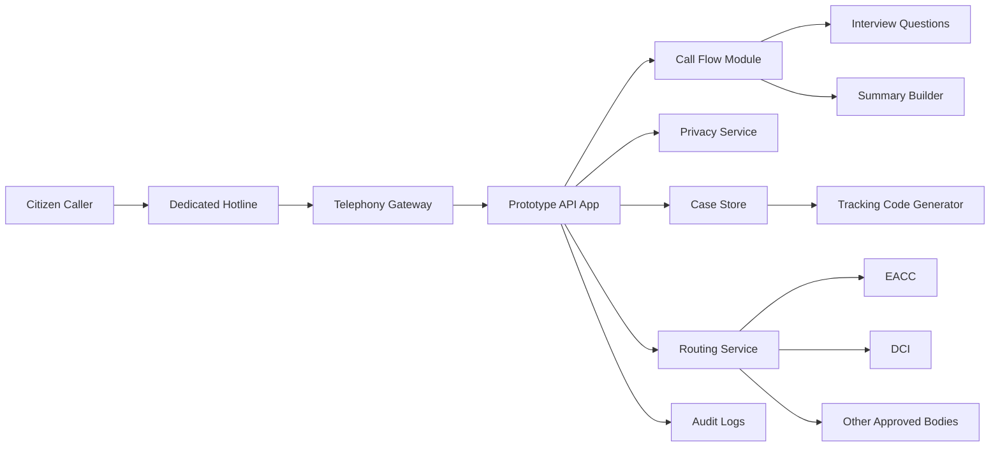

# ripoti-kwa-siri

`ripoti-kwa-siri` is a voice-first anonymous reporting platform for corruption and organized crime tips. It is designed so a citizen can call a dedicated number, safely share what they know, receive a tracking code, and have the report routed to the right investigative body without requiring a face-to-face visit.

This repository is currently at the prototype architecture stage. The goal is to prove the reporting flow with a small codebase before splitting the system into larger services.

## Service Flow

1. `The Call`: a citizen calls the hotline to report corruption, abuse of office, trafficking, extortion, or organized crime.
2. `The Shield`: the intake flow explains that the report will be stored without attaching the caller's phone number to the case record.
3. `The Interview`: the agent listens, captures the story, and asks clarifying questions that improve investigative value.
4. `The Receipt`: the caller receives a unique tracking code such as `Kiongozi-77`.
5. `The Hand-off`: the report is summarized, classified, and securely routed to the appropriate investigative body.

## Prototype Architecture



## Repository Structure

```text
ripoti-kwa-siri/
├── README.md
├── app/
│   ├── main.py
│   ├── api/
│   │   ├── routes/
│   │   └── schemas/
│   ├── core/
│   │   ├── config.py
│   │   ├── logging.py
│   │   └── security.py
│   ├── call_flow/
│   │   ├── intake.py
│   │   ├── questions.py
│   │   ├── summary.py
│   │   └── tracking.py
│   ├── integrations/
│   │   ├── telephony.py
│   │   ├── realtime.py
│   │   └── llm.py
│   ├── services/
│   │   ├── case_store.py
│   │   ├── privacy.py
│   │   └── routing.py
│   └── models/
│       ├── case.py
│       └── tracking.py
├── tests/
│   ├── test_intake.py
│   ├── test_privacy.py
│   └── test_routing.py
├── infra/
│   ├── containers/
│   └── scripts/
└── docs/
    ├── architecture/
    │   └── ripoti-kwa-siri-architecture.md
    └── product/
        └── ripoti-kwa-siri-service-flow.md
```

## What Each Area Means

- `app/main.py`: single FastAPI entrypoint for the prototype
- `app/api`: webhook endpoints, health endpoints, and request schemas
- `app/call_flow`: the actual intake journey, interview prompts, summary creation, and tracking-code logic
- `app/integrations`: provider-specific adapters kept at the edge of the prototype
- `app/services`: core prototype logic for privacy, case storage, and routing
- `app/models`: simple case and tracking data models
- `tests`: small focused tests for intake, privacy, and routing behavior
- `infra`: local container and helper scripts for running the prototype
- `docs`: architecture notes, service flows, and product decisions

## Prototype Scope

- handle intake for one anonymous report from start to finish
- generate a tracking code
- scrub caller identifiers before storing the case
- create a short referral summary
- route the case to a mock or early hand-off endpoint

## Design Principles

- `Anonymous by default`: the case record should not carry direct caller identity
- `Minimize data`: ask only for details that help routing or investigation
- `Track without identity`: the caller uses a tracking code instead of an in-person reference
- `Route intelligently`: each case goes to the institution best suited to act on it
- `Audit internally`: keep internal accountability without exposing the caller

## Important Note

Claims such as `encrypted`, `anonymous`, or `scrubbed` should only be shown to users when the actual telephony, storage, and hand-off implementation truly supports them.
