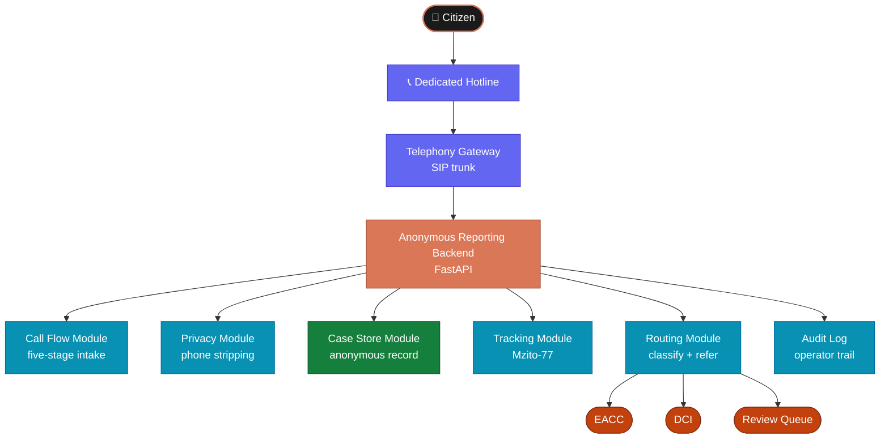

# System Overview

Ripoti Kwa Siri is built as a single prototype application. The goal is to prove
the full reporting journey end-to-end before splitting into separate deployable
services. Every major concern — intake, privacy, storage, routing — lives in one
codebase so the team can move fast and refactor with confidence.

---

## Module Map

The system is made up of seven modules. Each has a single responsibility.



---

## What Each Module Does

### Telephony Gateway
Accepts the inbound call from the reporting hotline. Hands the session to the
backend as a SIP participant inside a LiveKit room. Exposes only the minimum
metadata needed for operations — the caller's phone number is never passed
to the case record.

### Anonymous Reporting Backend
The main FastAPI application. Hosts all API routes, webhooks, and health checks.
Coordinates every other module. In the prototype this is one app; later versions
will split it into separate services.

### Call Flow Module
Runs the five-stage intake conversation: greeting → report capture → clarification
→ summary confirmation → tracking and close. The voice agent (Sauti) is guided by
a YAML system prompt loaded at startup. No hard-coded question lists — the LLM
adapts to what the caller says.

### Privacy Module
Strips or tokenises the caller's phone number before anything is written to the
case record. Applies prototype-level data minimisation rules consistently. This
module must run before any persistence happens.

### Case Store Module
Persists the anonymous case record to the database. Acts as the system of record
for all reports, summaries, statuses, and referral history. The data model is kept
small and easy to evolve. See [Data Model](./06-data-model) for the full field list.

### Tracking Module
Generates a unique, human-readable, non-sequential tracking code such as
`Mzito-77`. The caller is given this code at the end of the call. They can use
it later to check whether the report has been received or referred — without
disclosing their identity.

### Routing Module
After the call ends, classifies the case summary into `corruption`,
`organized_crime`, or `unknown`. Selects the correct institution and transmits the
anonymous case package. Uses a FallbackRoutingClassifier: Gemini 2.5 Flash →
OpenAI. If both fail, the case goes to the review queue. See [Routing Classifier](./05-routing-classifier).

### Audit Log
Records every operator action, access event, routing decision, and policy
application. Stored separately from the investigative case record so internal
oversight does not compromise caller privacy.

---

## Data Flow — Step by Step

1. A citizen dials the reporting hotline
2. The telephony gateway places the caller into a LiveKit room as a SIP participant
3. The Sauti voice agent joins the same room and begins the greeting
4. The call flow module runs the five-stage intake conversation
5. The privacy module strips the phone number before anything is saved
6. The case store module saves the anonymous report
7. The tracking module generates a code — e.g. `Mzito-77` — and the agent reads it aloud
8. The call ends
9. The routing module classifies the case summary
10. The report is transmitted to EACC, DCI, or placed in the review queue
11. The audit log records the full action trail

---

## Prototype Boundaries

This is a prototype. Some things are intentionally left simple:

| Decision | Prototype behaviour | Production intent |
|---|---|---|
| Deployment | Single FastAPI app | Split into separate services |
| Routing | Three categories | Subcategories, county routing |
| Privacy | Phone stripping | Full PII audit + retention policy |
| Storage | Local / simple DB | Encrypted, jurisdiction-aware store |
| Human fallback | Policy only | Live agent queue integration |

---

## Folder Structure

```
ripoti-kwa-siri/
├── app/
│   ├── main.py                   ← FastAPI app entry point
│   ├── api/
│   │   ├── routes/               ← API route handlers
│   │   └── schemas/              ← Request / response schemas
│   ├── core/
│   │   ├── config.py             ← Pydantic settings + YAML prompt loader
│   │   ├── logging.py
│   │   └── security.py
│   ├── call_flow/
│   │   └── controller.py         ← Five-stage intake orchestration
│   ├── integrations/
│   │   ├── telephony.py          ← SIP trunk + dispatch rule setup
│   │   ├── realtime.py           ← LiveKit agent server + session
│   │   └── llm.py                ← STT / LLM / TTS model config
│   ├── services/
│   │   ├── case_store.py         ← Case persistence
│   │   ├── intake_service.py     ← Intake orchestration
│   │   ├── privacy.py            ← Phone stripping + data minimisation
│   │   ├── routing.py            ← FallbackRoutingClassifier
│   │   ├── summary.py            ← Case summary builder
│   │   └── tracking.py           ← Tracking code generation
│   └── models/
│       ├── case.py               ← Case Pydantic model
│       └── tracking.py           ← Tracking code model
├── prompts/
│   └── anonymous_reporting_agent.yaml  ← Agent system prompt
├── run_agent.py                  ← Start the LiveKit voice agent
├── run_api.py                    ← Start the FastAPI server
└── tests/
    ├── test_intake.py
    ├── test_privacy.py
    └── test_routing.py
```

---

## Where to Go Next

| If you want to understand... | Read |
|---|---|
| How the voice agent is built | [Voice Pipeline](./02-voice-pipeline) |
| How calls arrive and connect | [Call Bridging](./03-call-bridging) |
| How the session runs | [Session Lifecycle](./04-session-lifecycle) |
| How routing decisions are made | [Routing Classifier](./05-routing-classifier) |
| What fields are stored | [Data Model](./06-data-model) |
| How privacy is enforced | [Privacy Layer](./07-privacy-layer) |
