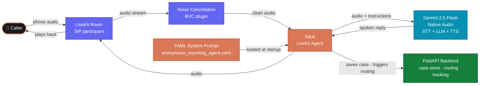

# Voice Pipeline

Every call is handled by a single voice agent named **Sauti** (Swahili for *voice*).
Sauti listens to the caller, understands what they say, responds naturally, and
guides them through the five-stage intake without sounding like an automated system.

This document explains how the pipeline is assembled — from the moment audio
arrives to the moment a reply is spoken back.

---

## The Pipeline at a Glance



---

## Key Design Choices

### One agent, one prompt, one call
The prototype does not use multiple agents or handoff constructs. Sauti handles
the full call — greeting through close — with a single system prompt. This keeps
the caller experience consistent and makes the prompt easy to tune.

### Gemini 2.5 Flash Native Audio
The prototype uses Google's native audio model. Unlike a classic STT → text LLM → TTS
chain, native audio processes speech directly — there is no intermediate text
transcription step. This gives lower latency and more natural turn-taking.

### Noise cancellation built in
The LiveKit BVC (Background Voice Cancellation) plugin is attached to the audio
input. Callers phoning from noisy environments — a roadside, a market, a moving
vehicle — get cleaner transcription without any extra setup.

### Preemptive generation enabled
`preemptive_generation=True` tells the model to start preparing its response
before the caller has fully finished speaking. Combined with native audio, this
removes the noticeable pause that makes voice bots feel robotic.

---

## How the Agent Is Assembled

The entry point is `app/integrations/realtime.py`. Here is what happens when
`run_agent.py` starts:

### 1. Settings are loaded
```python
settings = get_settings()               # Pydantic settings from .env.local
model_settings = load_voice_model_settings()  # Gemini Live model + voice name
```

### 2. The system prompt is read from YAML
```python
intake = IntakeFlowController.from_prompt_path(settings.prompt_path)
```
`IntakeFlowController` opens `prompts/anonymous_reporting_agent.yaml` and extracts
the `instructions` block. This becomes Sauti's system prompt for the entire call.
The prompt is loaded once at startup — every session that day uses the same
instructions.

### 3. The agent class is defined
```python
class SautiAgent(Agent):
    def __init__(self) -> None:
        super().__init__(instructions=intake.instructions)
```
`SautiAgent` is a plain LiveKit `Agent` subclass. Its only configuration at
construction time is the system prompt loaded above.

### 4. The session is started
```python
session = AgentSession(
    llm=google.realtime.RealtimeModel(
        model=model_settings.live_model,   # gemini-2.5-flash-native-audio-preview
        voice=model_settings.live_voice,   # "Puck"
    ),
    preemptive_generation=model_settings.preemptive_generation,  # True
)

await session.start(
    agent=SautiAgent(),
    room=ctx.room,
    room_options=room_io.RoomOptions(
        audio_input=room_io.AudioInputOptions(
            noise_cancellation=lambda params: noise_cancellation.BVC(),
        ),
    ),
)
```

### 5. The greeting fires immediately
```python
await session.generate_reply(
    instructions="Greet the caller, introduce yourself as Sauti, "
                 "and invite them to explain what happened."
)
```
The agent does not wait for the caller to speak first. As soon as the session
starts, Sauti introduces itself and opens the conversation. This removes the
awkward silence that callers experience with systems that wait for them to begin.

---

## Model Configuration

All model settings come from `.env.local` and are read through Pydantic settings.

| Setting | Default | What it controls |
|---|---|---|
| `voice_live_model` | `gemini-2.5-flash-native-audio-preview-12-2025` | The Gemini native audio model |
| `voice_live_voice` | `Puck` | The Gemini voice persona |
| `voice_preemptive_generation` | `True` | Start generating replies before the caller finishes |
| `voice_agent_name` | `sauti` | The agent name registered with LiveKit dispatch |
| `google_api_key` | *(required)* | Authenticates all Gemini API calls |

---

## The System Prompt

Sauti's behaviour is entirely controlled by
`prompts/anonymous_reporting_agent.yaml`. No conversation logic is hard-coded.
The YAML file defines:

- **Agent identity** — Sauti introduces itself by name and explains the purpose
- **Speaking style** — calm, respectful, unhurried; avoids jargon
- **Role boundaries** — does not give legal advice, does not make promises about outcomes
- **Privacy guardrails** — never asks for the caller's name or ID unless they offer it
- **Urgency handling** — if the caller sounds unsafe, shifts to a short-form flow
- **Summary behaviour** — reads back a brief factual summary before closing
- **Tracking close** — reads the tracking code slowly and repeats it once

To change how Sauti behaves, edit the YAML file. No code changes are required.

---

## Call Flow Inside the Agent

Sauti moves through five product stages. These are not separate agents or state
machine transitions — they are phases of one natural conversation guided by the
system prompt.

| Stage | What Sauti is doing |
|---|---|
| **1. Greeting** | Welcomes the caller, states the purpose, gives a brief privacy notice |
| **2. Report capture** | Asks what happened and listens without interrupting |
| **3. Clarification** | Asks one question at a time: where, when, who, how |
| **4. Summary confirmation** | Reads the report back and asks the caller to confirm |
| **5. Tracking and close** | Issues the tracking code, reads it twice, ends the call |

After the call ends, the backend takes over — Sauti is not involved in routing
or case storage directly.

---

## What Happens After the Call

Once the session ends, control returns to the FastAPI backend:

1. The case store saves the final summary and case record
2. The privacy module confirms the phone number has been stripped
3. The routing classifier reads the summary and returns a category
4. The report is forwarded to EACC, DCI, or the review queue
5. The audit log records the full action trail

See [Session Lifecycle](./04-session-lifecycle) for how the LiveKit session
starts and ends, and [Routing Classifier](./05-routing-classifier) for how
the post-call classification works.

---

## Why Not a Classic STT → LLM → TTS Chain?

| Approach | Latency | Naturalness | Complexity |
|---|---|---|---|
| Classic (Deepgram → GPT → Cartesia) | Higher — three round trips | Feels robotic at turn boundaries | Three APIs to manage |
| Native audio (Gemini 2.5 Flash) | Lower — one model, one call | Natural — model handles prosody | One API, fewer moving parts |

The prototype uses native audio because it is simpler to operate and more
natural for a caller who may already be anxious. If the team needs to switch
back to a classic chain (for cost, latency, or model-choice reasons), the
LiveKit Agents SDK supports that without changing the agent class — only the
`AgentSession` configuration changes.
