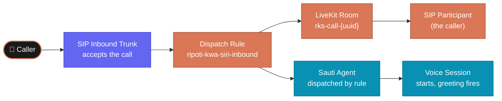
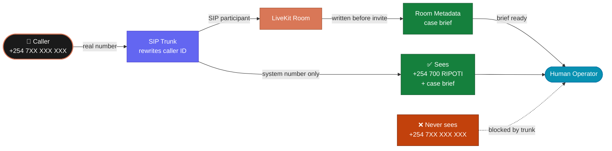

# Call Bridging

When a citizen dials the reporting hotline, the call does not go directly to the
agent process. It enters a **LiveKit room** first. Sauti then joins that room as
a participant. This separation is deliberate — it keeps the telephony layer clean,
isolates each caller in their own room, and makes future human fallback possible
without rebuilding the call.

---

## The Bridging Flow



---

## Step by Step

### 1. The caller dials
A citizen calls the dedicated reporting hotline number. The number is registered
against an **inbound SIP trunk** in LiveKit.

### 2. The trunk accepts the call
The inbound trunk verifies the call and hands it to the dispatch layer. The
caller's phone number is available here, but it must not be passed into the
case record. See [Privacy Layer](./07-privacy-layer).

### 3. The dispatch rule creates a room
The dispatch rule `ripoti-kwa-siri-inbound` uses an **individual room strategy**
with a fixed room prefix:

```json
{
  "name": "ripoti-kwa-siri-inbound",
  "rule": {
    "dispatchRuleIndividual": {
      "roomPrefix": "rks-call-"
    }
  },
  "roomConfig": {
    "agents": [
      { "agentName": "sauti" }
    ]
  }
}
```

Every inbound call gets a fresh, isolated room — e.g. `rks-call-a3f9c2`. No two
callers ever share a room.

### 4. The caller becomes a SIP participant
LiveKit bridges the phone call into the room as a **SIP participant**. From this
point the caller is just another room member — the same abstraction used by
web and mobile participants.

### 5. Sauti is dispatched
Because `agentName: sauti` is in the room config, LiveKit automatically dispatches
the Sauti agent into the same room. The agent connects as a participant on the
other side of the conversation.

### 6. The session starts and the greeting fires
Sauti initialises its `AgentSession`, connects to the room, and immediately
generates the opening reply:

> *"Greet the caller, introduce yourself as Sauti, and invite them to explain
> what happened."*

The caller hears this within seconds of the call being answered.

---

## Why a Room — Not a Direct Connection?

A direct phone-to-agent pipe would be simpler to draw on a diagram, but it
creates three problems:

| Problem | Room-based fix |
|---|---|
| Two callers could end up in the same session | Each call gets its own isolated room |
| Human fallback requires a new call setup | A human operator can join the existing room |
| Supervisor monitoring is not possible | A supervisor can observe the room as a silent participant |

The room is the primitive. Everything else — agent, caller, future human — is
just a participant in it.

---

## Configuration

All bridging config comes from `app/core/config.py` via Pydantic settings.

| Setting | Default | Purpose |
|---|---|---|
| `sip_trunk_name` | `ripoti-kwa-siri-inbound` | Name of the SIP trunk in LiveKit |
| `dispatch_rule_name` | `ripoti-kwa-siri-inbound` | Name of the dispatch rule |
| `dispatch_room_prefix` | `rks-call-` | Prefix for each generated room name |
| `voice_agent_name` | `sauti` | Agent name in dispatch rule and runtime must match |
| `sip_inbound_numbers` | *(from env)* | Comma-separated list of accepted inbound numbers |
| `sip_auth_username` | *(from env)* | SIP trunk authentication |
| `sip_auth_password` | *(from env)* | SIP trunk authentication |

The `voice_agent_name` value in config **must exactly match** the `agentName`
in the dispatch rule. If they differ, the call is bridged into the room but
Sauti is never dispatched.

---

## Human Escalation — Caller ID and the Operator Brief

When a call escalates to a human operator, two things must happen correctly
or the privacy guarantee breaks.



### Caller ID must show the system number — not the caller's number

The SIP trunk must be configured to always present the **system's own hotline
number** as the caller ID on any transfer, invite, or escalation leg. If the
trunk forwards the raw inbound number instead, the caller's identity is exposed
the moment the human picks up.

```
Inbound call:   +254 7XX XXX XXX  (caller's real number — visible at trunk only)
                        ↓
           SIP trunk strips and replaces
                        ↓
Operator sees:  +254 700 RIPOTI   (system hotline number — always)
```

This is a **SIP trunk configuration requirement**, not something the application
code controls. It must be verified during setup and re-verified after any trunk
change.

### The operator brief is written to room metadata before the human joins

Because the operator joins the existing LiveKit room, the application writes
the current case context to the room's metadata before the invitation is sent.
The operator's interface reads that metadata and displays the brief as soon as
they accept the job — before they speak a word to the caller.

```
Sauti detects escalation trigger
        ↓
Write case brief to room metadata:
  { case_id, tracking_code, urgency, category,
    narrative_so_far, entities, location,
    caller_safety_concern, escalation_reason }
        ↓
Invite human operator to room
        ↓
Operator interface shows brief
        ↓
Sauti tells caller: "I'm connecting you to a colleague now.
  They already have what you've shared — you won't need to repeat anything."
        ↓
Operator joins and speaks
```

The 5–10 seconds Sauti's message takes is the operator's reading window.

### What the operator never sees

| Blocked | Why |
|---|---|
| Caller's real phone number | SIP trunk presents system number instead |
| Raw SIP headers | Operator interface reads room metadata only |
| Caller's name or national ID | Never collected — not in room metadata |

See [Human Fallback](../product/04-human-fallback) for the full escalation
policy and the operator brief format.
