# Session Lifecycle

This document covers the full lifetime of a voice session — from the moment
`run_agent.py` is executed to the moment the caller hangs up and the room is
cleaned up by LiveKit.

---

## Lifecycle at a Glance

```mermaid
flowchart LR
    classDef phase   fill:#D97757,stroke:#9E4E2E,color:#fff
    classDef system  fill:#6366f1,stroke:#4338ca,color:#fff
    classDef model   fill:#0891b2,stroke:#0369a1,color:#fff
    classDef done    fill:#15803d,stroke:#14532d,color:#fff

    S["run_agent.py\nstarts"]:::system
    P["prewarm()\nprocess ready"]:::phase
    W["AgentServer\nwaiting for jobs"]:::system
    J["Job arrives\n(inbound call)"]:::system
    C["ctx.connect()\njoins room"]:::phase
    G["generate_reply()\ngreeting fires"]:::phase
    I["Intake conversation\n5 stages"]:::model
    E["Caller hangs up\nor session ends"]:::done
    CL["Room cleaned up\nby LiveKit"]:::done

    S --> P --> W --> J --> C --> G --> I --> E --> CL
```



---

## Entry Point — `run_agent.py`

The agent server starts with:

```bash
uv run run_agent.py
```

This calls `run()` in `src/infrastructure/voice/agent.py`, which hands off to the
LiveKit CLI:

```python
def run() -> None:
    from livekit.agents import cli
    cli.run_app(create_agent_server())
```

The CLI handles process management, signal handling, and job scheduling from
this point.

---

## Server Assembly — `create_agent_server()`

Before any call arrives, the server is assembled once:

```python
settings    = get_settings()           # Pydantic settings from .env.local
model_cfg   = load_voice_model_settings()  # Gemini model + voice name
intake      = IntakeFlowController.from_prompt_path(settings.prompt_path)
```

`intake.instructions` is the full text of the YAML system prompt. It is loaded
**once at startup** and reused for every session that day. If you update the
YAML while the server is running, restart the server to pick up the changes.

---

## Prewarm — Process Ready Signal

```python
def prewarm(proc: JobProcess) -> None:
    proc.userdata["vad"] = None
```

LiveKit calls `prewarm` when a worker process is ready to accept jobs. For the
classic STT → LLM → TTS chain, this is where you would load a VAD (Voice
Activity Detection) model into memory. With Gemini Native Audio, turn-taking
is handled inside the model itself — VAD is not required, so this is a no-op.

---

## Session Entrypoint — When a Call Arrives

When a dispatched job arrives (a caller has been bridged into a room), the
`session_entrypoint` coroutine runs:

```python
@server.rtc_session(agent_name="sauti")
async def session_entrypoint(ctx: JobContext) -> None:
    ctx.log_context_fields = {"room": ctx.room.name}

    session = AgentSession(
        llm=google.realtime.RealtimeModel(
            model=model_cfg.live_model,
            voice=model_cfg.live_voice,
        ),
        preemptive_generation=model_cfg.preemptive_generation,
    )

    await session.start(
        agent=SautiAgent(),
        room=ctx.room,
        room_options=room_io.RoomOptions(
            audio_input=room_io.AudioInputOptions(
                noise_cancellation=lambda params: noise_cancellation.BVC(),
            ),
        ),
    )
    await ctx.connect()
    await session.generate_reply(
        instructions="Greet the caller, introduce yourself as Sauti, "
                     "and invite them to explain what happened."
    )
```

What each line does:

| Line | What it does |
|---|---|
| `@server.rtc_session(agent_name="sauti")` | Registers this function as the handler for all jobs dispatched to the `sauti` agent |
| `ctx.log_context_fields` | Tags every log line from this session with the room name |
| `AgentSession(llm=...)` | Wires Gemini Native Audio as the voice model |
| `session.start(...)` | Connects the agent to the room with noise cancellation on the audio input |
| `ctx.connect()` | Establishes the agent's RTC connection to the room |
| `session.generate_reply(...)` | Fires the greeting immediately — Sauti speaks first |

---

## Required Environment Variables

The server will not start without these:

| Variable | Purpose |
|---|---|
| `REALTIME_URL` | LiveKit server URL (e.g. `wss://your-project.livekit.cloud`) |
| `REALTIME_API_KEY` | LiveKit API key |
| `REALTIME_API_SECRET` | LiveKit API secret |
| `GOOGLE_API_KEY` | Authenticates Gemini Native Audio calls |

---

## Optional Overrides

These have sensible defaults and can be changed in `.env.local`:

| Variable | Default | Purpose |
|---|---|---|
| `VOICE_AGENT_NAME` | `sauti` | Must match the dispatch rule's `agentName` |
| `VOICE_LIVE_MODEL` | `gemini-2.5-flash-native-audio-preview-12-2025` | Gemini model variant |
| `VOICE_LIVE_VOICE` | `Puck` | Gemini voice persona |
| `VOICE_PREEMPTIVE_GENERATION` | `true` | Start generating before the caller finishes speaking |

---

## Session End

A session ends when:

- the caller hangs up
- the agent completes the tracking and close stage and the session is released
- a timeout or network error terminates the room

LiveKit cleans up the room automatically. The backend is responsible for ensuring
the case record is saved and routing is triggered before or when the session ends.

---

## How to Start the Server

```bash
# Install dependencies
uv sync

# Copy and fill in environment variables
cp .env.example .env.local

# Start the agent server
uv run run_agent.py
```

If any required voice dependency is missing, `run_agent.py` exits with a clear
message before any connection is attempted.
