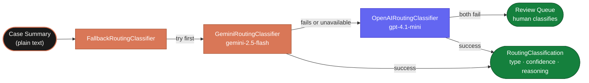

# Routing Classifier

After the call ends, the system reads the final case summary and decides where
to send it. This decision is made by the **routing classifier** — a module that
takes a plain-text summary and returns a structured category with a confidence
score and a one-sentence reason.

The classifier never drops a report. If both AI providers fail, the case is
automatically routed to the review queue for a human to classify.

---

## The Fallback Chain



---

## What the Classifier Returns

Every classifier returns a `RoutingClassification` with three fields:

```json
{
  "report_type": "corruption",
  "confidence": "high",
  "reasoning": "The summary describes a public official requesting a bribe at a checkpoint."
}
```

| Field | Values | Purpose |
|---|---|---|
| `report_type` | `corruption` · `organized_crime` · `unknown` | The routing category |
| `confidence` | `high` · `medium` · `low` | How certain the model is |
| `reasoning` | One sentence | A human-readable explanation for audit logs |

The `reasoning` field is written to the audit log so a reviewer can understand
why a case was routed to a particular institution without re-reading the full
summary.

---

## The Three Classifiers

### GeminiRoutingClassifier (primary)

Uses the Google Gen AI SDK with **structured JSON output** — the model is
constrained to return valid JSON matching the routing schema. This removes
the need for output parsing or retries caused by format errors.

```python
response = client.models.generate_content(
    model="gemini-2.5-flash",
    contents=f"{ROUTING_CLASSIFICATION_PROMPT}\n\nCase summary:\n{summary}",
    config={
        "response_mime_type": "application/json",
        "response_json_schema": ROUTING_CLASSIFICATION_SCHEMA,
    },
)
```

Available when: `GOOGLE_API_KEY` is set and `google-genai` is installed.

---

### OpenAIRoutingClassifier (first fallback)

Uses the OpenAI Responses API with **strict JSON schema enforcement**. Same
structured output guarantee as Gemini — the model cannot return free-form text.

```python
response = client.responses.create(
    model="gpt-4.1-mini",
    input=[...],
    text={
        "format": {
            "type": "json_schema",
            "name": "routing_classification",
            "schema": ROUTING_CLASSIFICATION_SCHEMA,
            "strict": True,
        }
    },
)
```

Available when: `OPENAI_API_KEY` is set and `openai` is installed.

---

## FallbackRoutingClassifier — The Coordinator

`FallbackRoutingClassifier` holds a list of classifiers and tries them in order:

```python
class FallbackRoutingClassifier:
    def __init__(self, classifiers=None):
        self._classifiers = classifiers or [
            GeminiRoutingClassifier(),
            OpenAIRoutingClassifier(),
        ]

    def classify(self, summary: str) -> RoutingClassification:
        errors = []
        for classifier in self._classifiers:
            if not classifier.is_available():
                continue
            try:
                return classifier.classify(summary)
            except Exception as exc:
                errors.append(f"{classifier.__class__.__name__}: {exc}")

        raise RuntimeError(f"Routing classification failed: {'; '.join(errors)}")
```

When both providers fail, the caller has already hung up and the case is saved.
The `RuntimeError` is caught by the backend, the case is placed in the review
queue with `report_type: unknown`, and a human reviewer assigns the correct
destination.

If a classifier is not available (missing API key or package), it is skipped
silently. If it is available but raises an exception, the error is recorded and
the next classifier is tried. The report is never lost.

---

## Routing Decision Table

Once a `report_type` is returned, the backend maps it to a destination:

| `report_type` | Destination | Typical reports |
|---|---|---|
| `corruption` | EACC | Bribery, procurement fraud, abuse of office, unexplained wealth |
| `organized_crime` | DCI | Trafficking, extortion, criminal conspiracy, violent intimidation |
| `unknown` | Review queue | Incomplete, ambiguous, mixed, or low-confidence reports |

No report is ever rejected. `unknown` cases go to a human reviewer who assigns
the correct destination.

---

## The Classification Prompt

Both AI classifiers receive the same prompt:

```
Classify this report. Reply with JSON only.
{
  "report_type": "corruption" | "organized_crime" | "unknown",
  "confidence": "high" | "medium" | "low",
  "reasoning": "one sentence"
}
```

Followed by the case summary text. The JSON schema constraint means the model
cannot deviate from this format regardless of the summary content.

---

## Configuration

| Setting | Default | Purpose |
|---|---|---|
| `routing_model` | `gemini-2.5-flash` | Gemini model used for classification |
| `google_api_key` | *(required for Gemini)* | Authenticates Gemini API calls |
| `openai_routing_model` | `gpt-4.1-mini` | OpenAI model used as fallback |
| `openai_api_key` | *(required for OpenAI fallback)* | Authenticates OpenAI API calls |

To use only one provider, set only that provider's API key. The other classifier
will report itself as unavailable and be skipped.
