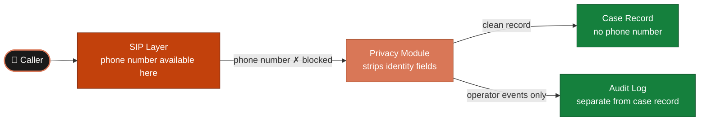
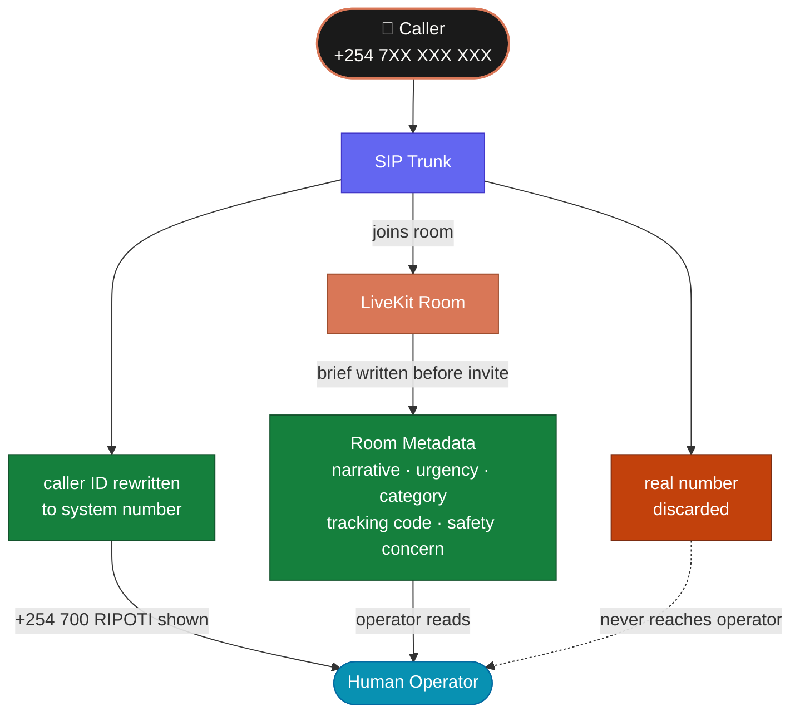

# Privacy Layer

The platform is built on one non-negotiable rule:

> **The caller's phone number must never appear in the case record.**

This document explains how that rule is enforced in the prototype — where in
the code the stripping happens, what the tracking code is designed to replace,
and what the current limitations are.

---

## The Privacy Boundary



---

## What Gets Stripped

The privacy module removes the following fields before any data is written
to the case record:

| Field | Action |
|---|---|
| `phone_number` | Stripped entirely — last two digits kept for log previews only |
| `caller_name` | Blocked — never requested unless offered voluntarily |
| `national_id` | Blocked — not collected |
| `home_address` | Blocked — not relevant to the allegation |

This is enforced in `app/services/privacy.py`:

```python
REDACTED = "[redacted]"

def scrub_phone_number(phone_number: str | None) -> str | None:
    if not phone_number:
        return None
    digits = "".join(ch for ch in phone_number if ch.isdigit())
    if len(digits) <= 2:
        return REDACTED
    return f"{REDACTED}{digits[-2:]}"

def strip_direct_identifiers(payload: dict[str, str]) -> dict[str, str]:
    blocked = {"phone_number", "caller_name", "national_id", "home_address"}
    return {key: value for key, value in payload.items() if key not in blocked}
```

`scrub_phone_number` keeps the last two digits for operational log previews
(e.g. `[redacted]42`) without exposing the full number. `strip_direct_identifiers`
removes identity keys entirely from any payload before it reaches the case store.

---

## The Tracking Code — Identity Replacement

The caller needs a way to follow up without disclosing who they are. The
tracking code solves this.

Instead of an occurrence-book reference number that requires a physical visit,
the system issues a code the caller can remember and quote over the phone or
by SMS.

```python
_PREFIXES = cycle(("Kiongozi", "Siri", "Ulinzi"))
_SEQUENCE = cycle(range(11, 99))

def generate_tracking_code() -> str:
    return f"{next(_PREFIXES)}-{next(_SEQUENCE)}"
```

This produces codes like `Mzito-77`, `Siri-13`, `Ulinzi-42`.

### Design requirements

| Requirement | Why |
|---|---|
| Human-readable | The agent reads it aloud and the caller writes it down |
| Non-sequential | Cannot be guessed by incrementing from a known code |
| No identity link | The code maps to a case ID internally, never to a phone number |
| Easy to repeat | Two syllables and a number — designed for verbal communication |

### Prototype limitation

The current generator uses a cycling sequence which is deterministic and
not truly unique at scale. Before production:

- Replace with a UUID-backed store
- Ensure no two active cases share the same code
- Add a lookup endpoint callable by phone or SMS

---

## Data Separation Principle

The prototype keeps two distinct records:

| Record | Contains | Who can access |
|---|---|---|
| **Case record** | Narrative, summary, routing, tracking code, status | Investigators, reviewers |
| **Audit log** | Operator actions, access events, routing decisions | Internal oversight only |

The phone number — even in scrubbed form — must not appear in the case record.
If operational requirements need it (e.g. for a follow-up callback), it is
stored separately with its own access controls and retention policy.

---

## What the Agent Must Not Do

The voice agent (Sauti) enforces the privacy rules conversationally:

- Does not ask for the caller's name unless they offer it
- Does not ask for national ID or home address under any circumstances
- Does not repeat the caller's phone number back to them
- Does not promise outcomes it cannot guarantee
- Does not record audio beyond what the platform explicitly stores

These rules are embedded in the YAML system prompt and are not enforced in
code alone — they require the prompt to be maintained correctly.

---

## Current Prototype Limitations

The prototype is honest about what it does not yet do:

| Gap | What it means |
|---|---|
| No end-to-end encryption claim | Audio and transcripts in transit depend on the provider's TLS — no additional encryption layer |
| No full anonymity guarantee | Operational logs at the telephony provider level may still retain metadata |
| No retention policy | Audio, transcripts, summaries, and referral receipts have no defined deletion schedule |
| No separate PII store | Scrubbed phone metadata is discarded rather than stored in a controlled vault |

These are known and acceptable for the prototype stage. They must be addressed
before any production deployment handling real reports.

---

## Privacy at Escalation — Caller ID Masking

The privacy boundary does not end when a human joins the call. It must hold
through escalation.



### The risk

When Sauti transfers a call to a human operator, the SIP leg that delivers
the call to the operator carries a caller ID field. If the trunk is not
configured correctly, the caller's real phone number appears on the operator's
screen — breaking the privacy guarantee at the exact moment human help was meant
to provide safety.

### The fix — SIP trunk caller ID override

The inbound SIP trunk must be configured to **replace the inbound caller ID**
with the system's own hotline number before any outbound or transfer leg is
created. This is a trunk-level setting, not application code.

```
Caller dials:        +254 7XX XXX XXX
                             ↓
Trunk rewrites caller ID to: +254 700 RIPOTI  (system number)
                             ↓
Operator's screen shows:     +254 700 RIPOTI  (never the real number)
```

### The operator brief is case metadata — not call metadata

The human operator gets context about the case through **LiveKit room metadata**,
not through SIP headers. The application writes the case brief to the room before
inviting the operator. The operator's interface reads the room — it never touches
raw SIP data.

This means the operator knows:
- Why the call was escalated
- What the caller has already shared
- Urgency and safety concern

Without ever seeing the caller's number, name, or any raw telephony metadata.

---

## Privacy Rules in Order of Enforcement

1. **At the SIP trunk** — caller ID is replaced with the system number before any transfer or escalation leg
2. **At the SIP layer** — the real phone number is available but not forwarded to the case record
3. **Before persistence** — `strip_direct_identifiers` removes blocked fields from any payload
4. **In logs** — `scrub_phone_number` replaces the number with `[redacted]{last two digits}`
5. **In the case record** — no identity fields present at write time
6. **In the audit log** — operator events recorded separately, no case content mixed in
7. **In room metadata** — operator brief contains case context only, never telephony metadata
8. **In the agent prompt** — Sauti is instructed not to request or repeat identity information
