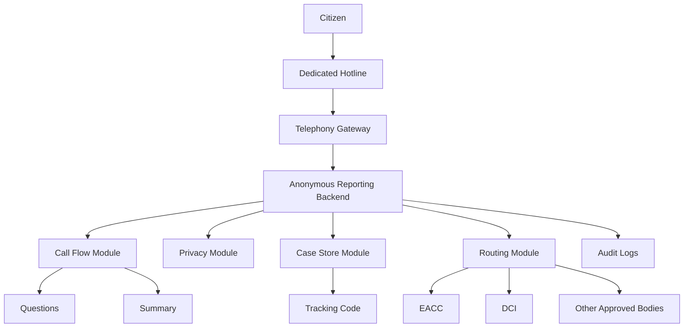

# ripoti-kwa-siri Prototype Architecture

## Purpose

`ripoti-kwa-siri` is a secure intake and referral platform for anonymous phone-based reporting. For the prototype, the goal is to prove the end-to-end reporting journey with one small application before breaking the platform into separate deployable services.

## Prototype Architecture



## Core Prototype Modules

### Telephony Gateway

- receives inbound hotline calls
- forwards sessions into the prototype app
- should expose only the minimum metadata needed for operations

### Anonymous Reporting Backend

- provides the main backend entrypoint for webhooks, health checks, and internal APIs
- keeps the first version simple by hosting the full reporting flow in one application
- coordinates intake, privacy, tracking, storage, and routing modules

### Call Flow Module

- handles the reporting journey from greeting through receipt
- asks structured follow-up questions
- builds the case summary for referral

### Privacy Module

- redacts or tokenizes the phone number before case persistence
- minimizes other identifying metadata
- applies simple prototype privacy rules consistently

### Case Store Module

- stores reports, summaries, statuses, and referral history
- acts as the prototype system of record for anonymous reports
- keeps the data model small and easy to evolve

### Tracking Module

- generates unique caller-safe tracking codes such as `Kiongozi-77`
- allows later status lookup without requiring identity disclosure
- must avoid sequential or easily guessed identifiers

### Routing Module

- classifies the final case summary into a broad category
- selects the right institution from that category
- securely transmits the anonymous case package
- records referral delivery status or mock hand-off status

### Audit Log

- records operator actions, access events, routing events, and policy decisions
- supports internal oversight while preserving caller privacy

## Recommended Prototype Folder Structure

```text
ripoti-kwa-siri/
├── README.md
├── app/
│   ├── main.py
│   ├── api/
│   │   ├── routes/
│   │   └── schemas/
│   ├── core/
│   │   ├── config.py
│   │   ├── logging.py
│   │   └── security.py
│   ├── call_flow/
│   │   └── controller.py
│   ├── integrations/
│   │   ├── telephony.py
│   │   ├── realtime.py
│   │   └── llm.py
│   ├── preview.py
│   ├── runtime.py
│   ├── services/
│   │   ├── case_store.py
│   │   ├── intake_service.py
│   │   ├── privacy.py
│   │   ├── routing.py
│   │   ├── summary.py
│   │   └── tracking.py
│   └── models/
│       ├── case.py
│       └── tracking.py
├── run_agent.py
├── run_api.py
├── tests/
│   ├── test_intake.py
│   ├── test_privacy.py
│   └── test_routing.py
├── infra/
│   ├── containers/
│   └── scripts/
└── docs/
    ├── architecture/
    └── product/
```

## Data Flow

1. A citizen calls the hotline.
2. The telephony gateway hands the session to the prototype app.
3. The call-flow module informs the caller how the report will be handled.
4. The system captures the story and asks clarifying questions.
5. The privacy module strips or isolates phone-linked data.
6. The case-store module saves the anonymous report.
7. A tracking code is generated and returned to the caller.
8. The report is summarized.
9. The routing module classifies the final summary and selects the destination.
10. The routing module transmits it to EACC, DCI, or another approved body.
11. Audit logs preserve the internal action trail.

## Security and Privacy Notes

- do not claim end-to-end encryption unless every link in the chain supports it
- do not claim full anonymity if operational logs still retain recoverable phone metadata
- store protected metadata separately from the investigative case record
- keep provider-specific code outside the core reporting logic so the prototype can evolve cleanly
- define retention policies separately for audio, transcripts, summaries, and referral receipts
