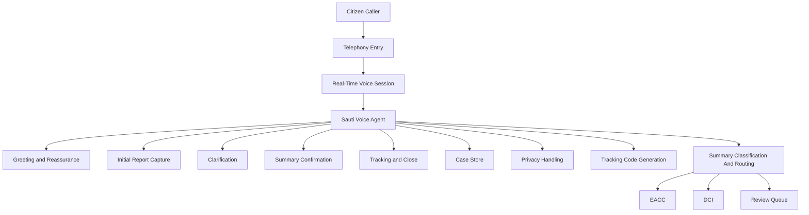

# ripoti-kwa-siri Voice Agent Architecture

## Purpose

This document defines the voice-agent architecture for the `ripoti-kwa-siri` prototype. It describes how the caller-facing agent should be structured, how it fits into the wider system, and how the conversation flow connects to storage, privacy, tracking, and routing.

The prototype should stay simple. The first version uses one voice agent, one main prompt, and one structured call flow.

## Core Design

The prototype uses:

- one caller-facing voice agent named `Sauti`
- one real-time voice session
- one main runtime prompt in [anonymous_reporting_agent.yaml](/Users/admin/ripoti-kwa-siri/prompts/anonymous_reporting_agent.yaml)
- one guided five-stage intake flow

The prototype does not need multiple agents or handoffs yet.
It also does not use task or task-group constructs; the first version keeps a single agent and prompt active for the whole call.

## High-Level Architecture

## Main Components

### Telephony Entry

- receives the caller into the reporting session
- connects the call into the real-time voice layer
- should expose only the operational metadata needed to run the session

### Real-Time Voice Session

- runs the real-time voice interaction
- manages the active voice agent in the session
- provides the orchestration layer for the prototype voice experience

### Sauti Voice Agent

- is the only caller-facing agent in the first version
- uses one main runtime prompt
- handles intake, clarification, urgency-aware questioning, summary confirmation, and call close
- should sound calm, respectful, and reassuring

### Runtime Prompt

The main prompt lives in [anonymous_reporting_agent.yaml](/Users/admin/ripoti-kwa-siri/prompts/anonymous_reporting_agent.yaml).

It defines:

- agent identity
- speaking style
- role boundaries
- privacy guardrails
- urgency handling behavior
- summary and tracking behavior

## Call Flow Inside the Agent

The agent should follow the product stages defined in [call-stages.md](/Users/admin/ripoti-kwa-siri/docs/product/call-stages.md):

1. greeting and reassurance
2. initial report capture
3. clarification
4. summary confirmation
5. tracking and close

These are workflow stages, not separate agents.

## Backend Dependencies

The voice agent should not act as the system of record by itself. It depends on backend capabilities for:

- `Case Store`
  stores the report, summary, status, and routing result

- `Privacy Handling`
  keeps caller-linked metadata separate from the standard case record

- `Tracking Code Generation`
  creates a caller-facing reference for follow-up

- `Routing Decision`
  classifies the final case summary into `corruption`, `organized_crime`, or `unknown`, then maps that category to the correct destination

## Post-Call Classification

The voice agent should stay focused on the conversation during the live call. Routing classification happens after the intake flow has produced a final summary.

The prototype sequence is:

1. Sauti completes the call and confirms the report summary.
2. The backend stores the final summary as part of the case record.
3. The routing classifier reads that summary and returns a structured category decision.
4. The backend maps the category to a destination such as `EACC`, `DCI`, or `review_queue`.
5. The hand-off step uses that destination to package and forward the case.

## Why One Agent Is Enough for the Prototype

One agent is the best fit for the first version because it:

- keeps the caller experience consistent
- avoids handoff complexity
- keeps the prompt strategy simple
- is easier to test and tune
- matches the narrow prototype scope

If the product later becomes more complex, the architecture can expand into tasks, tools, or multiple agents. That is not required for the first version.

## Relationship to Other Docs

- [ripoti-kwa-siri-architecture.md](/Users/admin/ripoti-kwa-siri/docs/architecture/ripoti-kwa-siri-architecture.md): overall system architecture
- [case-data-model.md](/Users/admin/ripoti-kwa-siri/docs/architecture/case-data-model.md): the fields the agent is trying to collect
- [call-stages.md](/Users/admin/ripoti-kwa-siri/docs/product/call-stages.md): the call flow the agent should follow
- [routing-rules.md](/Users/admin/ripoti-kwa-siri/docs/product/routing-rules.md): how the final report should be routed
- [anonymous_reporting_agent.yaml](/Users/admin/ripoti-kwa-siri/prompts/anonymous_reporting_agent.yaml): the main runtime prompt
