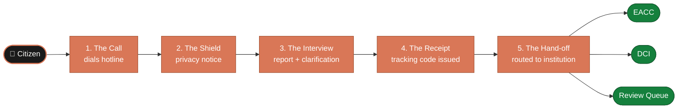

# Service Flow

This is what the product does, from the caller's point of view. A citizen dials
a number, speaks freely, and hangs up with a tracking code. Everything after that
happens without requiring them to do anything else.

---

## The Journey at a Glance

---

## Stage 1 — The Call

A citizen dials the dedicated reporting hotline. The platform answers immediately
with the Sauti voice agent. No hold music, no menu, no press-one-for-English.

> *"You have reached Ripoti Kwa Siri. You can report corruption or organized crime
> here. We will record your report without attaching your phone number to the
> case file."*

The caller does not need to know anything before dialling. Sauti explains
everything.

---

## Stage 2 — The Shield

Before the caller shares anything, Sauti delivers a short privacy notice. This
stage has one job: make the caller feel safe enough to speak.

What the system communicates:
- the report is handled confidentially
- the phone number is not attached to the case file
- the caller does not need to give their name
- the caller can stop at any point

What the system never says:
- "your call is completely anonymous" — it is not an absolute guarantee
- "the authorities will take action" — the system cannot promise outcomes
- "your identity is protected forever" — retention policies are not unlimited

Honesty here is not a legal nicety. Callers who discover they were misled will
not call again.

---

## Stage 3 — The Interview

This is the core of the call. Sauti captures the narrative then asks targeted
follow-up questions — one at a time, never like a form.

**Opening:**
> *"Please tell me what happened, in your own words."*

**Clarification questions Sauti may ask:**
- Where did this happen?
- When did it happen?
- Who or what was involved?
- How do you know this?
- Is anyone in immediate danger right now?
- Did you notice any vehicle markings, badge numbers, or document names?

**What Sauti does not do:**
- interrupt the caller mid-story
- demand details the caller clearly does not have
- ask for the caller's name, ID, or address
- repeat questions the caller already answered

If the caller sounds frightened or unsafe, the interview shortens immediately.
Safety comes first. See [Human Fallback](./04-human-fallback) for when a human
operator takes over.

---

## Stage 4 — The Receipt

Once enough information is captured, Sauti reads back a short summary and asks
the caller to confirm or correct it. This is the caller's last chance to adjust
anything before the report is saved.

After confirmation, a **tracking code** is issued:

> *"Your tracking code is Mzito-77. I will read it again — Mzito-77.
> Please keep it safe. You can use it later to check whether your report
> has been received or referred."*

**Tracking code requirements:**
- Easy to remember and repeat aloud
- Not sequential — cannot be guessed from another caller's code
- Not linked to the caller's phone number

The caller hangs up with this code as their only connection to the report.
No receipt required, no return visit required.

---

## Stage 5 — The Hand-off

After the call ends, the system classifies the case and routes it automatically.

| Report type | Destination | Typical allegations |
|---|---|---|
| Corruption | EACC | Bribery, procurement fraud, abuse of office |
| Organized crime | DCI | Trafficking, extortion, criminal conspiracy |
| Unclear / mixed | Review queue | Incomplete or ambiguous cases |

The referral package sent to the institution includes:

- Anonymous case ID
- Tracking code
- Summary of allegations
- Event timeline and location
- Entities involved
- Urgency and risk flags

The caller's phone number is **not** included.

---

## Non-Functional Requirements

| Requirement | What it means in practice |
|---|---|
| **Privacy** | Phone number never appears in the case record |
| **Auditability** | Every operator action and routing decision is logged |
| **Resilience** | Intake stays available during call spikes or partner outages |
| **Traceability** | Every referral has a delivery trail and acknowledgement |
| **Human override** | Trained staff can take over any call at any point |

---

## Open Questions for Later Versions

- Will callers be able to check their case status by phone, SMS, or both?
- What institutions beyond EACC and DCI are in scope?
- What exact privacy language can be used under Kenyan law?
- Will the first release be fully automated, human-assisted, or hybrid?
