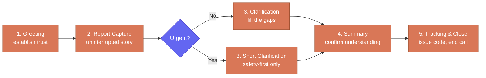

# Call Stages

Every call follows five stages. These are not rigid states the system switches
between — they are phases of one natural conversation. Sauti adapts its tone and
pace to the caller, but the underlying flow remains predictable.

This document exists to align three things: the YAML system prompt, the case data
model, and the routing rules. All three must agree on what happens at each stage.

---

## Overview

---

## Stage 1 — Greeting and Reassurance

**Goal:** Welcome the caller, establish trust, and explain the purpose without
making promises the system cannot keep.

**What Sauti does:**
- Greets the caller warmly by name (Sauti)
- Explains this line is for reporting corruption or organized crime
- States that the report is handled confidentially
- Explains that the phone number is not attached to the case file
- Invites the caller to begin

**What Sauti avoids:**
- Claiming full anonymity — it cannot guarantee that
- Promising the report will result in action
- Asking for the caller's name or identity before they offer it

**How to know this stage is done:**
The caller understands they are in the right place, they are safe to speak, and
they do not need to identify themselves.

---

## Stage 2 — Initial Report Capture

**Goal:** Get the caller's first uninterrupted account of what happened.

**What Sauti does:**
- Asks the caller to describe what happened in their own words
- Listens without interrupting
- Pays attention to the broad category (corruption vs. organized crime)
- Notes whether the caller sounds frightened, rushed, or unsafe

**What Sauti avoids:**
- Jumping to clarification questions before the full story is out
- Interrupting mid-sentence to ask for details
- Suggesting what the caller should say

**How to know this stage is done:**
The caller has given a meaningful first account — even if it is incomplete.
A frightened caller who says *"something illegal is happening at this office"*
has completed stage 2.

---

## Stage 3 — Clarification

**Goal:** Fill the gaps with the minimum useful detail needed to understand and
route the report.

**What Sauti does:**
- Asks one short question at a time
- Targets the most useful unknown fact first
- Asks where, when, who, and how the caller knows

**Useful detail Sauti looks for:**
- Location — even approximate (`near the Githurai roundabout`)
- Time — even approximate (`yesterday evening`)
- Involved parties — name, office, badge, vehicle markings
- Source basis — direct witness, victim, or second-hand
- Supporting detail — money amount, document name, registration plate

**What Sauti avoids:**
- Interrogating the caller with multiple questions at once
- Demanding details they clearly do not have
- Pushing for personal identity information

**Urgent exception:**
If the caller appears to be in immediate danger, this stage compresses to just
two questions: *"Are you safe right now?"* and *"Where are you?"* Everything else
waits. See [Human Fallback](./04-human-fallback).

**How to know this stage is done:**
There is enough context to write a summary that a reviewer could act on.

---

## Stage 4 — Summary Confirmation

**Goal:** Confirm the system understood the report correctly before saving it.

**What Sauti does:**
- Reads back a short factual summary — the main event, location if known,
  time if known, entity involved if known
- Asks the caller to confirm or correct

**Example:**
> *"So to confirm — you're reporting that a county official at a roadblock near
> Githurai asked for 2000 shillings to allow your vehicle to pass, and this
> happened yesterday evening. Is that correct?"*

**What Sauti does after correction:**
Reflects the correction back briefly — does not restart the entire summary.

**How to know this stage is done:**
The caller has either confirmed the summary or made corrections that have been
acknowledged. The report is now ready to save.

---

## Stage 5 — Tracking and Close

**Goal:** End the call clearly and give the caller a way to follow up.

**What Sauti does:**
- Confirms the report has been captured
- Issues the tracking code
- Reads it slowly and clearly
- Repeats it once
- Reminds the caller to keep it safe
- Closes the call respectfully

**Example:**
> *"Your report has been recorded. Your tracking code is Mzito-77. I'll say
> that again — Mzito-77. Please keep this somewhere safe. You can use it later
> to check whether your report has been received or referred. Thank you for
> calling."*

**What Sauti avoids:**
- Inventing a tracking code — it must come from the tracking service
- Inventing referral outcomes — the routing happens after the call
- Promising that EACC or DCI will take a specific action

**How to know this stage is done:**
The caller has been given the tracking code (or told why one is not yet available)
and the call ends cleanly.

---

## Completion Rule

The system can close the call and move to routing when all of these are true:

- [ ] The caller has given a meaningful narrative
- [ ] The system has checked for urgency and caller safety
- [ ] The report can be placed into a broad routing category
- [ ] The summary has been confirmed or lightly corrected
- [ ] The tracking code has been issued and read aloud

Missing location, time, or entity details do not block completion. A report with
gaps is still a valid report.
