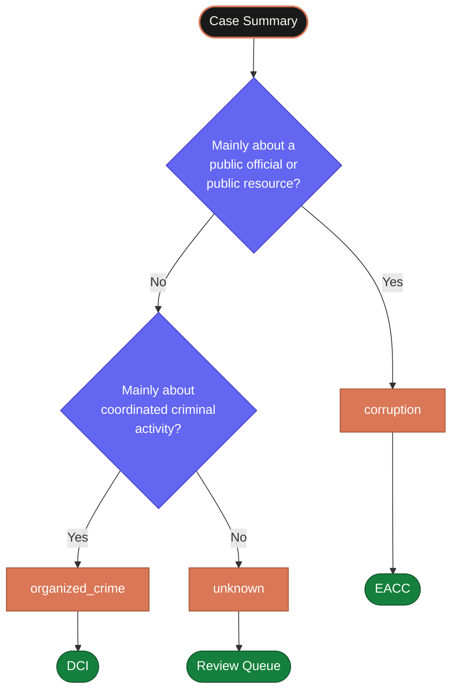

# Routing Rules

After the call ends, the system reads the case summary and decides where to send
it. This document defines the categories, the destinations, and the examples
a reviewer or LLM should use to make that decision correctly.

This is not a legal or institutional routing policy. It is a practical decision
guide for the prototype stage.

---

## The Three Categories

The prototype uses exactly three routing categories. No more — clarity and
auditability matter more than precision at this stage.

| Category | Destination | When to use |
|---|---|---|
| `corruption` | EACC | The report is mainly about public officials abusing their position or public resources |
| `organized_crime` | DCI | The report describes coordinated criminal activity involving multiple actors |
| `unknown` | Review queue | The report is incomplete, ambiguous, or does not clearly fit either category |

**No report is rejected.** If the system cannot classify confidently, the case
goes to the review queue — not into the void.

---

## Routing Decision Flow



---

## Corruption — Route to EACC

Use `corruption` when the report is mainly about a public official abusing their
position or public resources for personal gain.

**Applies to:**
- Bribery — demanding or accepting money for a public service or decision
- Procurement fraud — manipulating a public tender or contract
- Abuse of office — using an official position for personal advantage
- Misuse of public resources — government vehicles, funds, or assets used privately
- Unexplained payments — money changing hands around public services without justification
- Conflicts of interest — officials involved in decisions that benefit them personally

**Examples:**

> *"A traffic officer stopped my vehicle and said he would only let me go if I paid him 500 shillings."*
→ `corruption` → EACC

> *"A procurement officer at the county gave the contract to his cousin's company."*
→ `corruption` → EACC

> *"A government Land Cruiser was parked outside a private business all weekend."*
→ `corruption` → EACC

---

## Organized Crime — Route to DCI

Use `organized_crime` when the report describes criminal activity that is
coordinated, involves multiple actors, or involves serious crimes like trafficking,
extortion, or violent intimidation.

**Applies to:**
- Trafficking — movement of people or goods through illegal networks
- Extortion — demanding money under threat
- Criminal conspiracy — multiple actors coordinating illegal activity
- Violent intimidation — threats or violence to silence or control people
- Kidnapping or abduction — unlawful detention or movement of a person
- Organized gangs — structured criminal groups operating across locations

**Examples:**

> *"Every Friday a group of men comes to the market and takes money from the traders by threatening them."*
→ `organized_crime` → DCI

> *"I saw young women being moved in unmarked vehicles to a private compound. This has happened three times."*
→ `organized_crime` → DCI

> *"A group is running a fake job scheme and taking money from young men who want to work abroad."*
→ `organized_crime` → DCI

---

## Unknown — Route to Review Queue

Use `unknown` when the report cannot be confidently placed into either category.

**Applies when:**
- The caller was too afraid or rushed to give enough context
- The allegation mixes corruption and organized crime without a clear primary issue
- The report is too vague to classify — but may still be valuable
- The system's confidence in its classification is low

**Examples:**

> *"Something illegal is happening at that office. I can't explain right now."*
→ `unknown` → Review queue

> *"I think they are stealing and also threatening people but I'm not sure which is worse."*
→ `unknown` → Review queue

A human reviewer in the queue assigns the correct destination and can contact
the caller via their tracking code if more detail is needed.

---

## Urgency Is Not Routing

Urgency affects how quickly a case is reviewed — not which institution receives it.

A `corruption` case can be urgent. An `organized_crime` case can be low urgency.
An `unknown` case can be the most urgent case of the day.

| Urgency level | Meaning | Routing effect |
|---|---|---|
| `normal` | Standard review timeline | None |
| `urgent` | Reviewer should look at this today | Flagged in queue, no destination change |
| `high_risk` | Caller may be in danger | Immediate human review, still routed by category |

---

## The Classification in Practice

The routing classifier (`FallbackRoutingClassifier`) reads the case summary and
returns:

```json
{
  "report_type": "corruption",
  "confidence": "high",
  "reasoning": "The caller describes a county official demanding payment at a checkpoint."
}
```

The `reasoning` field is written to the audit log so any reviewer can understand
the classification without re-reading the full summary. See
[Routing Classifier](../architecture/05-routing-classifier) for how this is
implemented technically.

---

## What the Routing Decision Does Not Do

- It does not guarantee the institution will take action
- It does not expose the caller's identity to the institution
- It does not prevent manual reclassification by a reviewer
- It does not close the case — the case stays open until the institution acknowledges
